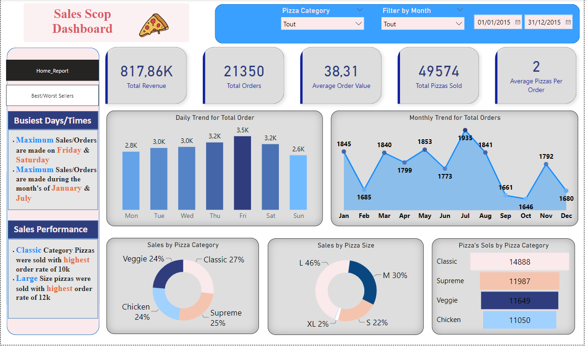
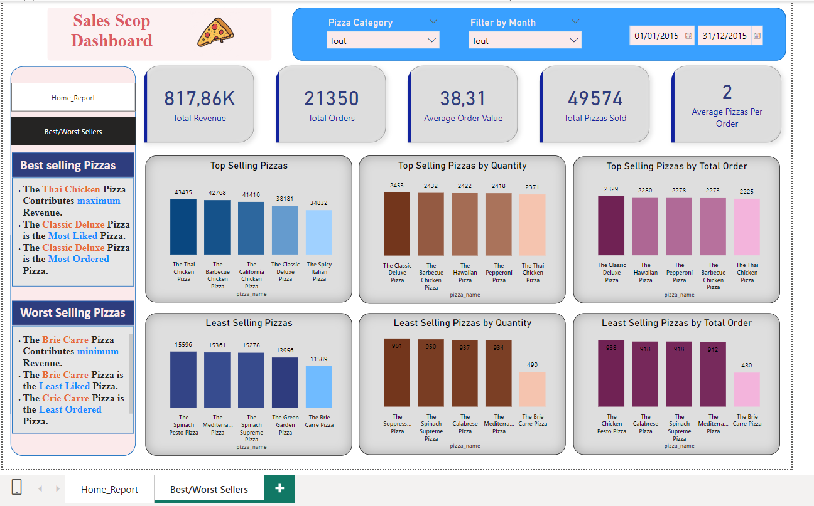

# ANALYSE DES VENTES DE PIZZAS

Bienvenue dans le dépôt du projet d'analyse des ventes de pizzas ! Ce projet vise à obtenir des informations sur les données de ventes de pizzas afin de comprendre les préférences des clients, les types de pizzas populaires et les tendances de vente à l'aide de méthodes analytiques et de techniques de visualisation.

## OBJECTIF

L'objectif de ce projet est d'analyser de manière approfondie les données de ventes de pizzas, en identifiant des indicateurs clés tels que le chiffre d'affaires total, la valeur moyenne des commandes, le nombre total de pizzas vendues, le nombre total de commandes. De plus, nous cherchons à visualiser divers aspects de nos données de ventes de pizzas afin de comprendre les tendances clés.

## PROBLÉMATIQUE

Nous cherchons à analyser les indicateurs clés de nos données de ventes de pizzas afin de comprendre les performances de notre entreprise. Notre intention est d'examiner les éléments suivants :
- Chiffre d'affaires total
- Valeur moyenne de la commande
- Total des pizzas vendues
- Total des commandes
- Nombre moyen de pizzas par commande

De plus, nous cherchons à visualiser divers aspects de nos données de ventes de pizzas afin de comprendre les tendances clés.

## MÉTHODOLOGIE

Cette section présente la méthodologie utilisée pour mener ce projet en utilisant SQL server management studio et PowerBI pour la manipulation, l'analyse et la visualisation des données. L'analyse avec SQL a permis de manipuler les données de ventes de pizzas, tandis que la visualisation avec PowerBI a permis de présenter les insights obtenus.

## Visualisation des données
Le rapport est composé de 2 pages :
* Home:

* Best/worst sellers:

## RÉSUMÉ DES INSIGHTS CLÉS

Sur la base de l'analyse des données de ventes de pizzas, les insights clés suivants ont été identifiés :
Jours de commande les plus fréquents : Les commandes culminent les week-ends, particulièrement les vendredis et samedis.
Tendances saisonnières : Le nombre le plus élevé de commandes se produit pendant les mois de juillet et janvier.
Catégorie de vente principale : La catégorie Classique contribue le plus bien aux revenus et aux commandes totales.
Taille de pizza populaire : Les pizzas de taille Large génèrent les ventes les plus élevées.
Meilleur contributeur au chiffre d'affaires : La Pizza au Poulet Thaï contribue le plus au chiffre d'affaires global.
Meilleure vente de pizza : La Pizza Deluxe Classique est la pizza la plus vendue en termes de quantité totale vendue et de commandes totales.
Plus faible contributeur au chiffre d'affaires : La Pizza au Brie Carré représente le chiffre d'affaires minimum, la quantité totale vendue et les commandes totales.

## CONCLUSION

Merci d'avoir exploré le projet d'analyse des ventes de pizzas ! L'analyse révèle des insights précieux sur les tendances de vente de pizzas, les préférences des clients et les contributeurs aux revenus. Ces résultats peuvent informer les décisions stratégiques et les efforts marketing pour améliorer la performance commerciale. Les lecteurs sont invités à approfondir l'analyse et à contribuer au développement du projet. N'hésitez pas à explorer le dépôt de code pour reproduire l'analyse ou suggérer des améliorations.

## Contact

Pour toute question, veuillez me contacter à : messaoud.daanoune@gmail.com

